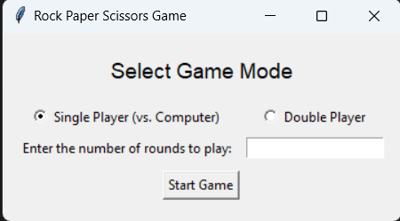

# Rock Paper Scissors Game 🪨📄✂️

A classic game with a modern twist - now playable both against the computer and with another player!

## Details

**Programming Language**: Python 3

**Modules Used**:
- `tkinter`: Used for building the graphical user interface.
- `random`: For generating random choices when playing against the computer.

## Features

1. **Dual Mode**: Play solo against the computer or challenge a friend in two-player mode.
2. **Custom Rounds**: Decide the number of rounds you want to play.
3. **Intuitive UI**: A clean and user-friendly interface ensures seamless gameplay.

## Getting Started

### Prerequisites

Ensure you have Python 3 installed on your machine. 

### Installation

1. Clone the repository: git clone https://github.com/Bisalkumar/Rock-Paper-Scisor_game.git
2. Navigate to the directory and run the game: python game.py

## How to Use

1. Launch the application.
2. Select the desired game mode - Single Player (against Computer) or Double Player (Player 1 vs Player 2).
3. Specify the number of rounds you wish to play.
4. If in Double Player mode, players take turns choosing their moves.
5. At the end of all rounds, the game will declare the overall winner or if it's a draw.

## Screenshots

## Contributions

Contributions are always welcome! Please see the `CONTRIBUTING.md` file for more details (if you decide to include one).

## License

This project is licensed under the MIT License. See the `LICENSE` file for more details.

## Acknowledgement

Special thanks to Youtube for guidance and resources, and to the Python community for making this game possible.

